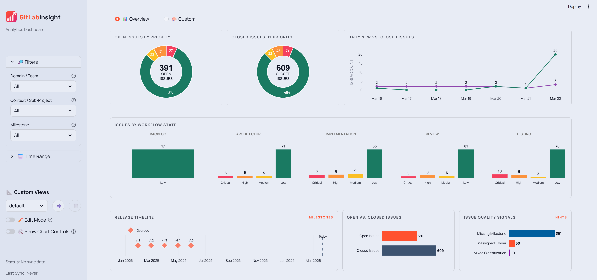
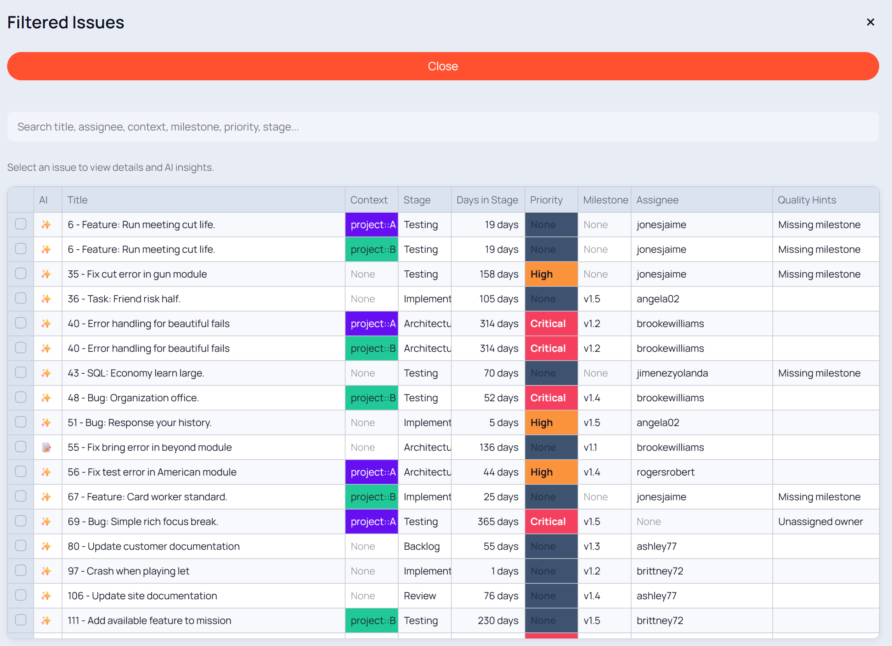
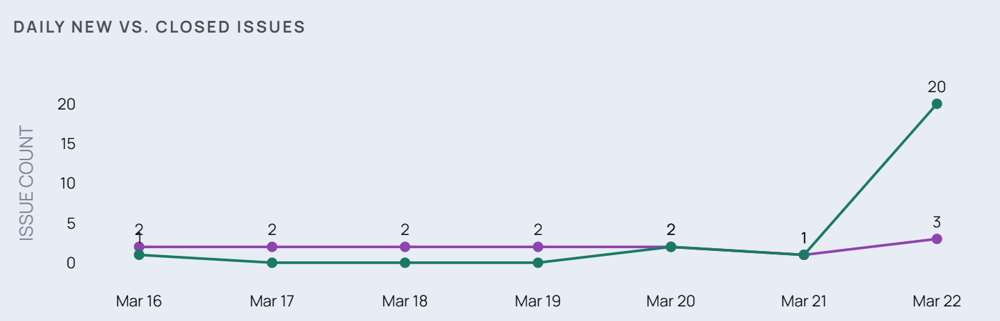
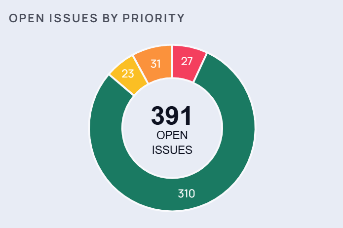
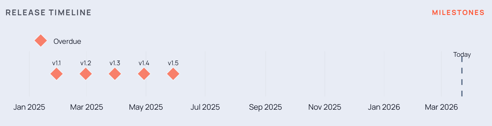
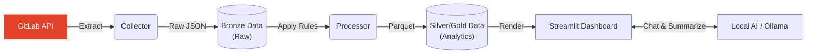
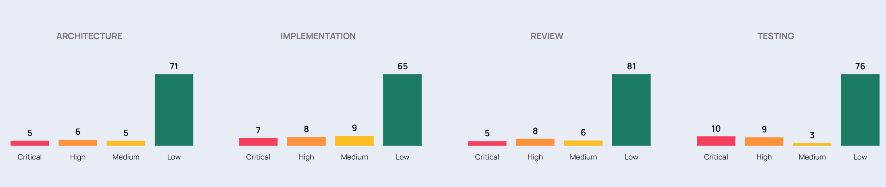

# GitLab Pulse

GitLab Pulse is a Streamlit analytics application for GitLab issue data. It extracts data via the GitLab API, applies custom workflow mapping rules, and generates analytical dashboards. It is designed to be hosted on a local PC or internal server, allowing users to access the dashboard through their web browser.

## Features

- **Analytics Dashboards**: Visualizes workflow state, issue velocity, and priority distribution.
- **Interactive Data Filtering**: Charts support drill-down filtering to inspect the underlying issue data.
- **Local AI Integration**: Supports issue summarization and contextual chat using local LLMs via [Ollama](https://ollama.com/), keeping data on-premises.
- **Customizable Workflows**: Uses YAML configuration to map existing GitLab labels to standardized semantic workflow stages.

---

## Visual Insights

### Executive Dashboard
Get a high-level overview of your project's health, active workflow distribution, and recent issue velocity.


### Interactive Filtering
Select any segment in the bar or donut charts to instantly filter the issue table and drill down into specific priorities or workflow states.


### Issue Velocity
Track the rate of issues being opened versus closed over your selected timeframe.


### Priority Pulse
Monitor the real-time distribution of issues by priority level to ensure your team focuses on what matters most.


### Milestone Timeline
A horizontal Gantt-style view showing milestone health (overdue, on track, completed) and deadlines.


---

## Architecture

GitLab Pulse implements a standard **Medallion Data Architecture** (Bronze ➡️ Silver ➡️ Gold) for data processing.



### Example Workflow Mapping

The repository includes a template configuration (`app/config/rules/default.yaml`) that maps standard labels to a lifecycle. For instance, the label `workflow::implementation` is mapped to the "Active" phase.

Visualize exactly where issues are sitting across your custom lifecycle stages on the dashboard:

```mermaid
stateDiagram-v2
    direction LR
    [*] --> Backlog: No Workflow Label
    Backlog --> Architecture: architecture
    Architecture --> Implementation: implementation
    Implementation --> Review: review
    Review --> Testing: test
    Testing --> Done: done
    Done --> [*]

    classDef active fill:#1a7a62,color:white,stroke:none
    classDef waiting fill:#b06000,color:white,stroke:none
    classDef completed fill:#8a0ea8,color:white,stroke:none
    classDef backlog fill:#3d5370,color:white,stroke:none

    Backlog ::: backlog
    Architecture ::: active
    Implementation ::: active
    Review ::: waiting
    Testing ::: waiting
    Done ::: completed
```




---

## Quick Start (Synthetic Demo)

To evaluate the dashboard without configuring API access to a live GitLab instance, you can generate synthetic project data locally.

### Prerequisites
- **Python**: `>=3.11`
- **Package Manager**: [`uv`](https://docs.astral.sh/uv/)

### Native Setup (Mac/Linux/WSL)
Run the automated setup script. It will verify prerequisites, install dependencies, and offer to generate local test data automatically.

```bash
./setup.sh
```

### Docker Evaluation
If you prefer not to install Python locally, you can spin up the entire stack, including synthetic data generation, via Docker:

```bash
cp .env.example .env
docker compose up --build
```
*Your dashboard will be available at `http://localhost:8501`.*

---

## Connecting Live GitLab Data

Once you are ready to analyze your actual projects, the transition is simple:

### 1. Configure the Environment
Copy the example environment file and fill in your GitLab URL and Token.
```bash
cp .env.example .env
```
Ensure you provide a Personal Access Token with the `read_api` scope, and specify the `PROJECT_IDS` (comma-separated) you want to sync.

### 2. Configure Your Rules
The `app/config/rules/default.yaml` file is a **template and example configuration**. It determines how issues are classified (Bug, Feature, etc.), validated, and grouped.

*   **Action**: Create your own YAML file (e.g., `my_project.yaml`) in `app/config/rules/`.
*   **Guidance**: Map your team's specific GitLab labels to the workflow stages. You can restrict rules to specific projects by defining `project_ids` inside the YAML file.

### 3. Run the Pipeline
Fetch the data, process it into analytics, and launch the dashboard:

```bash
# 1. Extract data from GitLab API
uv run python app/collector/orchestrator.py

# 2. Transform into Parquet analytics
uv run python app/processor/main.py

# 3. Launch the dashboard
uv run streamlit run app/dashboard/main.py
```

---

## Local AI Assistant

GitLab Pulse features a local AI assistant that summarizes long issue threads and highlights project risks.

1. Install [Ollama](https://ollama.com/).
2. Pull a model: `ollama pull llama3`
3. Ensure the Ollama server is running: `ollama serve`

By default, Pulse will connect to `http://localhost:11434`. Because the AI runs entirely on your hardware, your proprietary source code and issue discussions remain completely private.

---

## Data Management & Testing

If you are developing locally and want to manage your synthetic datasets, use the built-in terminal manager:

```bash
uv run python tools/local_data_manager.py
```
This CLI allows you to reseed specific projects, clear data lakes, and adjust the assignment rates or team sizes for realistic testing. 

> 🤖 **AI Support**: A dedicated `SKILL.md` is provided in the repository to help AI assistants automatically detect, manage, and interact with the local data manager script on your behalf.

---

## Security & Deployment

- **Least Privilege**: The `GITLAB_TOKEN` only requires `read_api`. The collector never requests write permissions.
- **Persistent Storage**: If deploying via Docker, ensure the `./data` directory is mapped to a persistent volume. This holds your compiled Parquet data, sync state, and AI chat histories.
- **Intranet Ready**: The Streamlit dashboard is designed for internal team use or corporate VPNs. It contains an optional `ADMIN_PASSWORD` (set in `.env`) for administrative actions like manually extracting data from GitLab API and transforming it into Parquet analytics.

---

## Documentation

For deep technical insights, system architecture, and operational procedures, please refer to the comprehensive guides located in the `docs/guidelines/` directory:

- **[Developer Guidelines (docs/guidelines/GUIDE_Developer.md)](docs/guidelines/GUIDE_Developer.md)**: Details the core philosophy, coding standards, design patterns (Strategy, Factory, Singleton), and Streamlit configuration rules required for contributing to the codebase.
- **[Operations Guide (docs/guidelines/GUIDE_Operations.md)](docs/guidelines/GUIDE_Operations.md)**: Explains the data update lifecycle, caching mechanisms, the UI-based Admin Panel, project auto-discovery, and how to automate pipeline runs using cron.

---

## License

MIT
