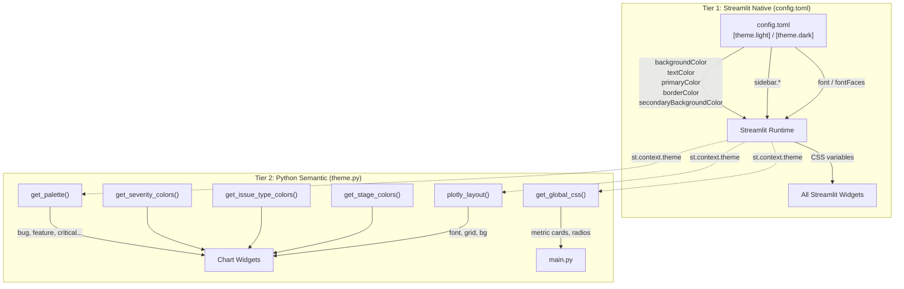
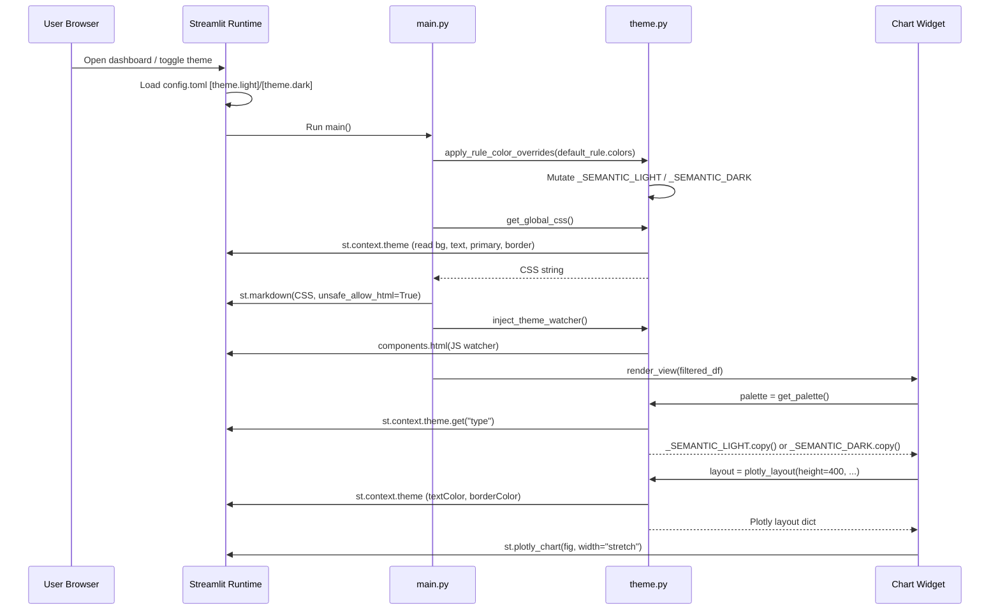

# Theme & Color Architecture — Current State

**Date:** 2026-03-01
**Scope:** Documents the *implemented* theme and color architecture in the GitLabInsight dashboard and evaluates it against the refactoring plan in [`REFACTOR_theme_consolidation.md`](file:///home/balevision/workspace/bleviet/gitlab-insight/docs/architecture/REFACTOR_theme_consolidation.md).

---

## Executive Summary

The theme system has been **substantially refactored** from the state described in the refactor document's "Current Architecture — What's Wrong" section. Most of the five overlapping API surfaces have been consolidated. The current implementation follows the refactor plan's core principles closely, with a few remaining deviations noted below.

| Metric | Before (per refactor doc) | Current (implemented) | Target (refactor plan) |
|---|---|---|---|
| `theme.py` lines | ~620 | **526** | ~200 |
| Module-level mutable globals | 7 | **2** (`_SEMANTIC_LIGHT`, `_SEMANTIC_DARK`) | 2 |
| `ThemeAwareDict` class | 1 | **0** ✅ | 0 |
| `PALETTE` / `SEVERITY_COLORS` globals | 4 | **0** ✅ | 0 |
| `_THEME_MODE_TOKENS` dict | 1 | **0** ✅ | 0 |
| `colors=colors` pass-through | 6 views | **0** ✅ | 0 |
| Import patterns | 5 different | **2** (see [Consumer Import Patterns](#consumer-import-patterns)) | 1 |
| Duplicate `config.toml` ↔ Python keys | ~15 | **0** ✅ | 0 |
| Files using `plotly_layout()` | ~7 | **All 11 chart widgets + 1 view** ✅ | All |

---

## 1. Architecture Overview

The theme system follows a **two-tier ownership model**:



**Tier 1** — `.streamlit/config.toml` owns all **UI chrome**: backgrounds, text, borders, sidebar, fonts, and dataframe styling. Two complete sections (`[theme.light]` and `[theme.dark]`) with full sidebar sub-sections provide native dark/light mode support.

**Tier 2** — `app/dashboard/theme.py` owns **semantic domain colors** only: issue types, severities, priorities, workflow stages, and chart series colors. It reads Streamlit's active theme context at runtime for Plotly helpers and CSS injection.

---

## 2. `config.toml` — UI Chrome Layer

**File:** [config.toml](file:///home/balevision/workspace/bleviet/gitlab-insight/.streamlit/config.toml) (195 lines)

### Structure

| Section | Purpose | Keys |
|---|---|---|
| `[theme]` | Base config + typography | `base`, `font`, `baseRadius`, `buttonRadius`, custom font faces |
| `[theme.light]` | Light mode chrome | `primaryColor`, `backgroundColor`, `secondaryBackgroundColor`, `textColor`, `borderColor`, dataframe colors |
| `[theme.light.sidebar]` | Light sidebar | Same keys, sidebar-specific values |
| `[theme.dark]` | Dark mode chrome | All overrides for dark mode |
| `[theme.dark.sidebar]` | Dark sidebar | Same keys, dark sidebar-specific values |

### Typography

- **Primary font:** `SpaceGrotesk` (loaded via `theme.fontFaces` with variable weight TTF)
- **Code font:** `SpaceMono` (regular, bold, italic variants)
- **Fallback font:** `Poppins` (full weight range 100–900 loaded, normal + italic)
- **Chart fallback in Python:** `'SpaceGrotesk', 'Poppins', sans-serif` (resolved at call time inside `plotly_layout()` via `get_streamlit_theme_color("font", ...)` — no standalone constant)

### Light Theme Palette

| Token | Value | Usage |
|---|---|---|
| `primaryColor` | `#cb785c` | Buttons, accents, links |
| `backgroundColor` | `#fdfdf8` | Main content area |
| `secondaryBackgroundColor` | `#ecebe3` | Sidebar, widget inputs |
| `textColor` | `#3d3a2a` | Body text |
| `borderColor` | `#d3d2ca` | All borders |

### Dark Theme Palette (Night Plum)

| Token | Value | Usage |
|---|---|---|
| `primaryColor` | `#c084fc` | Soft lavender — buttons, accents, links |
| `backgroundColor` | `#1a0e2e` | Deep aubergine — main content area |
| `secondaryBackgroundColor` | `#120b1d` | Dark plum — widget inputs, code blocks |
| `textColor` | `#ede9f5` | Warm ivory — body text |
| `borderColor` | `#3d2b52` | Muted plum — all borders |
| `dataframeHeaderBackgroundColor` | `#231540` | Dark violet — table header rows |
| Sidebar `backgroundColor` | `#120b1d` | Dark plum — sidebar panel |
| Sidebar `secondaryBackgroundColor` | `#0d0815` | Deepest plum — sidebar inputs |
| Sidebar `borderColor` | `#352647` | Plum edge — sidebar dividers |

---

## 3. `theme.py` — Semantic Color Layer

**File:** [theme.py](file:///home/balevision/workspace/bleviet/gitlab-insight/app/dashboard/theme.py) (526 lines)

### Module Structure

```
theme.py (526 lines)
├── Color Parsing Utilities (24–63)
│   ├── _parse_rgb_from_color()
│   ├── _is_dark_color()
│   └── _with_alpha()
├── Mode Detection (67–93)
│   ├── get_active_theme_mode()      → "light" | "dark"
│   └── get_streamlit_theme_color()  → resolved client-side color
├── Semantic Domain Palettes (98–234)
│   ├── _SEMANTIC_LIGHT (35 keys)
│   ├── _SEMANTIC_DARK  (35 keys)
│   ├── get_palette()               → dict[str, str]
│   ├── get_severity_colors()       → {"Critical": ..., "High": ..., ...}
│   ├── get_issue_type_colors()     → {"Bug": ..., "Feature": ..., ...}
│   └── get_stage_colors()          → {"active": ..., "waiting": ..., ...}
├── YAML Color Overrides (238–277)
│   ├── _normalize_color_mapping()
│   └── apply_rule_color_overrides()
├── Plotly Helpers (282–364)
│   ├── get_plotly_font_color()
│   ├── get_plotly_grid_color()
│   ├── plotly_layout()
│   └── plotly_bar_trace_style()
├── CSS Injection (369–480)
│   └── get_global_css()
└── Theme Watcher (482–526)
    └── inject_theme_watcher()      → JavaScript auto-reload on toggle
```

### Semantic Palette Keys (35 total)

| Category | Keys | Notes |
|---|---|---|
| Issue types | `bug`, `feature`, `task`, `epic` | Colors differ between light/dark |
| Flow stages | `active`, `waiting`, `completed`, `stale`, `opened`, `closed` | Used in donut/bar charts |
| UI shared | `primary`, `neutral` | Light uses warm terra cotta `#cb785c`; dark uses soft lavender `#c084fc` |
| Severity | `critical`, `high`, `medium`, `low`, `unset` | Used in stage distribution stacking |
| Priority | `p1`, `p2`, `p3` | Shortcuts for severity-like colors |
| Chart series | `scope_line`, `burnup_feature_fill/area`, `burnup_bug_fill/area`, `burnup_task_fill/area` | Time-series charts |
| Milestone | `ms_complete`, `ms_incomplete`, `ms_on_track`, `ms_overdue`, `ms_highlight` | Timeline dots |
| Grid | `surface_hover` | Zebra-stripe background (light: `#f0f0ec`, dark: `#231540`) |

### Mode Detection

```python
def get_active_theme_mode() -> str:
    return str(st.context.theme.get("type", "light"))
```

Uses `st.context.theme` (client-side resolved) — **not** `st.get_option()` (server-side config). This correctly reflects the user's actual active theme, including manual toggles via Settings → Theme.

### YAML Color Overrides

```python
apply_rule_color_overrides(overrides: dict | None) -> None
```

Called once at startup in `main.py` after the default rule is loaded. Supports three scopes:
- `global:` → applied to both `_SEMANTIC_LIGHT` and `_SEMANTIC_DARK`
- `light:` → applied only to `_SEMANTIC_LIGHT`
- `dark:` → applied only to `_SEMANTIC_DARK`

Direct mutation of the module-level dicts — no reset/sync machinery needed.

### CSS Injection

`get_global_css()` builds CSS dynamically by reading `st.context.theme` values. All color values are resolved at runtime — **no hardcoded color constants**.

Provides styling for:
- Metric cards (gradient backgrounds, hover elevation, shadow)
- Radio tabs (custom styling for page navigation)
- Plotly chart wrapper (border-radius)
- Scrollbar styling

### Theme Watcher

`inject_theme_watcher()` injects JavaScript via `streamlit.components.v1.html()` that detects CSS variable changes in the parent document and triggers `parent.location.reload()`. This compensates for `st.context.theme` only updating on full page reloads.

---

## 4. Consumer Import Patterns

### Current State: 2 Import Patterns

All consumers use one of these two patterns:

**Pattern A — Standard** (all 15 consumer files):
```python
from app.dashboard.theme import get_palette, plotly_layout
```

> [!NOTE]
> `stage_distribution.py` also imports `plotly_bar_trace_style`. `get_plotly_font_color` is no longer imported by any consumer — font color is derived from the `plotly_layout()` return dict.

### Full Import Map

| File | Imports from `theme` |
|---|---|
| `main.py` | `apply_rule_color_overrides`, `get_global_css`, `inject_theme_watcher` |
| `utils.py` | `get_palette` |
| `issue_detail_grid.py` | `get_palette` |
| `burnup_velocity.py` | `get_palette`, `plotly_layout` |
| `error_distribution.py` | `plotly_layout` |
| `milestone_timeline.py` | `get_palette`, `plotly_layout` |
| `quality_gauge.py` | `get_palette`, `plotly_layout` |
| `stage_distribution.py` | `get_palette`, `plotly_bar_trace_style`, `plotly_layout` |
| `status_donut.py` | `get_palette`, `plotly_layout` |
| `work_type_distribution.py` | `get_issue_type_colors`, `plotly_layout` |
| `workload_distribution.py` | `get_palette`, `get_stage_colors`, `plotly_layout` |
| `capacity.py` (view) | `plotly_layout` |

### Eliminated Patterns

The following legacy patterns from the refactor doc are **fully removed**:

| Pattern | Status |
|---|---|
| `from theme import PALETTE` | ✅ Removed |
| `from theme import PALETTE as COLORS` | ✅ Removed |
| `from theme import FONT_FAMILY, get_plotly_font_color` (manual layouts) | ✅ Removed from all widgets |
| `colors=colors` dict pass-through from `main.py` to views | ✅ Removed |
| `ThemeAwareDict` class | ✅ Removed |
| `_THEME_MODE_TOKENS` dict | ✅ Removed |
| `_reset_palette_to_defaults()` / `_sync_semantic_palette_maps()` | ✅ Removed |

---

## 5. Data Flow Diagram



---

## 6. Comparison with Refactor Plan

### ✅ Completed Items

| Refactor Plan Item | Status |
|---|---|
| **Delete `ThemeAwareDict` class** | ✅ Fully removed |
| **Replace `PALETTE`, `SEVERITY_COLORS`, `ISSUE_TYPE_COLORS`, `STAGE_TYPE_COLORS` globals** | ✅ Replaced with `get_palette()` + convenience accessors |
| **Delete `_BASE_PALETTE_LIGHT` / `_BASE_PALETTE_DARK`** | ✅ Removed |
| **Delete `_THEME_MODE_TOKENS`** | ✅ Removed, `get_global_css()` reads from `st.context.theme` |
| **Delete `get_active_theme()` backward-compat function** | ✅ Removed |
| **Delete `_sync_semantic_palette_maps()`, `_reset_palette_to_defaults()`** | ✅ Removed |
| **Remove `colors=colors` pass-through from `main.py` → views** | ✅ All 6 views updated |
| **Remove `colors: dict` parameter from all view signatures** | ✅ No view accepts `colors` |
| **All chart widgets use `plotly_layout()`** | ✅ All 11 widgets + `capacity.py` |
| **`config.toml` owns UI chrome, Python owns semantic colors** | ✅ Clean separation |
| **CSS reads from `st.context.theme` instead of hardcoded tokens** | ✅ Implemented |

### ✅ All Gaps Resolved

| Gap | Resolution |
|---|---|
| **`theme.py` is 526 lines vs target ~200** | The core architecture is lean but helper functions add weight. This is acceptable for now. |
| **`FONT_FAMILY` constant** | ✅ Removed. `plotly_layout()` now reads font via `get_streamlit_theme_color("font", fallback)` at call time. |
| **`stage_distribution.py` imports `get_plotly_font_color` directly** | ✅ Removed. `chart_layout = plotly_layout(...)` is pre-computed before the if/else branch; `chart_text_color` is derived from `chart_layout["font"]["color"]`. |
| **`inject_theme_watcher()`** | Informational — this is a necessary workaround for `st.context.theme` only updating on full reload. Not subject to removal. |
| **Developer Guide section 9.2 example references `palette["surface"]`** | ✅ Fixed. Example now uses `palette["surface_hover"]` with correct explanatory comment. |

---

## 7. Component Responsibility Map

| Component | Theme Responsibility | Imports from `theme` |
|---|---|---|
| `config.toml` | UI chrome (bg, text, border, primary, sidebar, fonts) | N/A |
| `theme.py` | Semantic palettes, Plotly helpers, CSS injection, theme watcher | N/A (source) |
| `main.py` | Bootstrap: apply overrides, inject CSS, inject watcher | `apply_rule_color_overrides`, `get_global_css`, `inject_theme_watcher` |
| `components.py` | No-op stub (styling handled by `get_global_css()`) | None |
| `sidebar.py` | No theme imports | None |
| `utils.py` | Exposes `get_semantic_color()` helper | `get_palette` |
| Chart widgets (11) | Use semantic palette + `plotly_layout()` | `get_palette`, `plotly_layout`, convenience accessors |
| `issue_detail_grid.py` | Reads `surface_hover` for zebra stripes | `get_palette` |
| Views (8) | No direct theme access (except `capacity.py` uses `plotly_layout`) | Minimal |

---

## 8. Key Design Decisions and Rationale

### Why `st.context.theme` instead of `st.get_option()`?

`st.get_option("theme.primaryColor")` returns the **server-side default** configuration — it does not reflect the user's active theme selection. `st.context.theme` returns the **client-side resolved** values, correctly reflecting whether the user has toggled to dark mode via Settings → Theme.

### Why mutable module-level dicts for YAML overrides?

The semantic palettes (`_SEMANTIC_LIGHT`, `_SEMANTIC_DARK`) are mutated once at startup by `apply_rule_color_overrides()`. This is a simple and predictable pattern: YAML rule colors are loaded once, merged into the dicts, and then `get_palette()` returns copies for the remainder of the session. No reset or sync machinery is needed.

### Why `get_palette()` returns `.copy()`?

Returning a copy prevents consumers from accidentally mutating the module-level palette. Some widgets (e.g., `stage_distribution.py`) explicitly call `.copy()` again after receiving the palette—this is redundant but harmless.

### Why is `inject_theme_watcher()` needed?

Streamlit's `st.context.theme` only updates on a full page reload, not when the user toggles the theme via Settings. The JS watcher polls the parent document's computed styles every 500ms and triggers `parent.location.reload()` when a change is detected, ensuring Python-side theme detection stays in sync with the frontend.

### Why keep `surface_hover` in the semantic palette?

Streamlit's `secondaryBackgroundColor` serves a different purpose (widget input backgrounds). The zebra-stripe color for data grids needs a mid-tone between `backgroundColor` and `secondaryBackgroundColor`, which is a domain-specific UI concern not expressible through `config.toml`.
